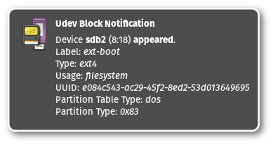
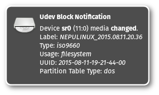

udev-block-notify
=================

**Notify about udev block events**

This runs in background and produces notifications whenever udev (or systemd)
receives an event about a block device. Notifications look like this:

Or for optical media:

These are just examples, it shows information about every block device.

Requirements
------------

To compile and run `udev-block-notify` you need:

* [libnotify](http://library.gnome.org/devel/notification-spec/)
* [systemd](http://www.freedesktop.org/wiki/Software/systemd) (or `udev` which has been merge into `systemd`)
* [markdown](http://daringfireball.net/projects/markdown/) (HTML documentation)
* `gnome-icon-theme` and `gnome-icon-theme-extras` (or anything else that includes the required media icons)

Some systems may require additional development packages for the libraries.
Look for `libnotify-devel`, `systemd-devel`, `libudev-devel` or similar.

Build and install
-----------------

Building and installing is very easy. Just run:

> make

followed by:

> make install

This will place an executable at `/usr/bin/udev-block-notify`,
documentation can be found in `/usr/share/doc/udev-block-notify/`.
Additionally a systemd unit file is installed to `/usr/lib/systemd/user/`.

Usage
-----

Just run `udev-block-notify` to run it once. A systemd user service can be
started and/or enabled with `systemctl --user start udev-block-notify`
or `systemctl --user enable udev-block-notify`.

### Upstream

URL: [GitHub.com](https://github.com/eworm-de/udev-block-notify)  
Mirror: [eworm.de](http://git.eworm.de/cgit.cgi/udev-block-notify/)
